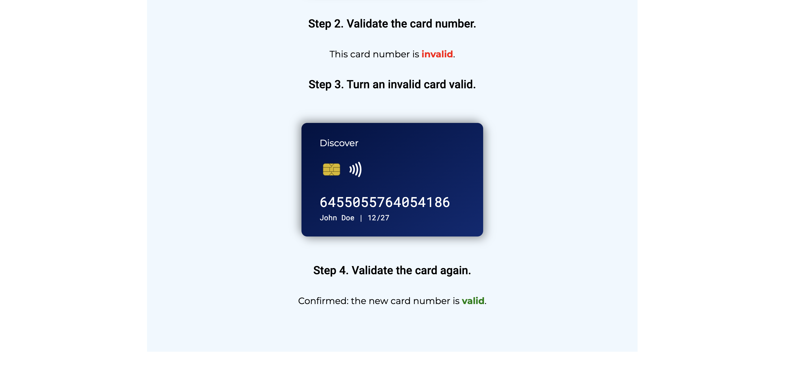

# Credit Card Validator

## Summary of the Project

This project provides a simple web application to validate credit card numbers using the Luhn algorithm. Users can generate card numbers based on selected credit card companies, validate them, and make corrections if necessary.

You can view the live site here: [Credit Card Validator](https://theografiska.github.io/credit-card-validator/).

### Technologies Used

- **HTML**: For the structure of the web application.
- **CSS**: For styling the application and enhancing user experience.
- **JavaScript**: For implementing the credit card validation logic and handling user interactions.

### Main Functionality Built

1. **Card Generation**: Users can select a credit card company from a dropdown menu and press a button to generate a new card number, which is then displayed on a visually appealing design card.
  
2. **Card Validation**: Users can click a button to validate the generated card number, receiving instant feedback on its validity.

3. **Correction of Invalid Cards**: If the card number is invalid, users have the option to correct the number by clicking a button.

4. **Re-validation**: After making corrections, users can re-validate the card number.

### Screenshots of the Website


*Initial view*


*Generation of a card*


*Validation of a card, generating a new corrected card, and re-validating it*

### How to Run the Project Locally

1. Clone the repository:
   ```bash
   git clone https://github.com/theografiska/credit-card-validator.git

2. Open `index.html` in your web browser.

### Contributing

If you would like to contribute to this project, please feel free to fork the repository and submit a pull request. Any suggestions or improvements are welcome!

### License

This project is licensed under the MIT License.